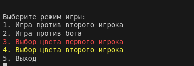
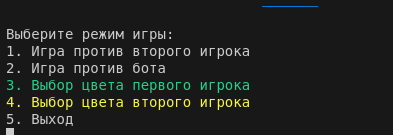
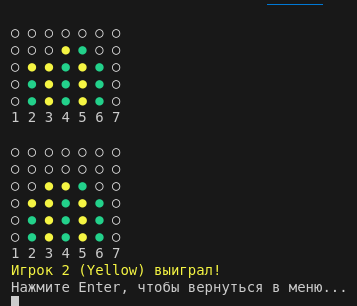
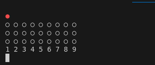

# FSharpLab4
## Игра 4 в ряд
### Юнусов Роман Ильдарович


## ключевые моменты кода

Код проверки победы
```f#
let checkWin (board: Board) color =
    let rec checkDirection x y dx dy count =
        if
            x < 0
            || x >= Array2D.length1 board
            || y < 0
            || y >= Array2D.length2 board
        then
            count
        else if board.[x, y] = color then
            checkDirection (x + dx) (y + dy) dx dy (count + 1)
        else
            count

    let rec checkAllDirections x y =
        checkDirection x y 1 0 0 >= 4
        || // right
        checkDirection x y 0 1 0 >= 4
        || // down
        checkDirection x y 1 1 0 >= 4
        || // down + right
        checkDirection x y 1 -1 0 >= 4 // down + left

    seq {
        for row in 0 .. (Array2D.length1 board - 1) do
            for col in 0 .. (Array2D.length2 board - 1) do
                if board.[row, col] = color && checkAllDirections row col then
                    yield true
    }
    |> Seq.exists (id)
```

Код бота
```f#
let botMove (board: Board) (botColor: Color) (playerColor: Color) =
    let rnd = Random()

    let canWin color =
        seq {
            for col in 0 .. (Array2D.length2 board - 1) do
                let boardCopy = Array2D.copy board

                if dropBall boardCopy col color then
                    if checkWin boardCopy color then
                        yield Some col
                else
                    yield None
        }
        |> Seq.tryPick id

    let canBlock () = canWin playerColor

    match canWin botColor with
    | Some col ->
        dropBall board col botColor |> ignore
        printfn "Бот выбрал колонку %d" (col + 1)
    | None ->
        match canBlock () with
        | Some col ->
            dropBall board col botColor |> ignore
            printfn "Бот выбрал колонку %d" (col + 1)
        | None ->
            let rec chooseRandomCol () =
                let col = rnd.Next(Array2D.length2 board)

                if dropBall board col botColor then
                    printfn "Бот выбрал колонку %d" (col + 1)
                else
                    chooseRandomCol ()

            chooseRandomCol ()
```

основной геймплейный цикл
```f#
let rec gameLoop board player1Turn (player1Color: Color) (player2Color: Color) =
    Console.Clear()
    let currentPlayer = if player1Turn then player1Color else player2Color
    printBoard board currentPlayer -1

    if isBoardFull board then
        printfn "Ничья!"
        printfn "Нажмите Enter, чтобы вернуться в меню..."
        Console.ReadLine() |> ignore
        ()
    else if player1Turn then
        printColorMessage player1Color $"Ход игрока 1 ({player1Color})\n"
        let col = selectColumn player1Color board

        if dropBall board col player1Color then
            if checkWin board player1Color then
                printBoard board currentPlayer -1
                printColorMessage player1Color $"Игрок 1 ({player1Color}) выиграл!\n"
                printfn "Нажмите Enter, чтобы вернуться в меню..."
                Console.ReadLine() |> ignore
                ()
            else
                gameLoop board (not player1Turn) player1Color player2Color
        else
            printfn "Столбец %d заполнен, выберите другой." (col + 1)
            gameLoop board player1Turn player1Color player2Color // Ход не передается
    else
        printColorMessage player2Color $"Ход игрока 2 ({player2Color})\n"
        let col = selectColumn player2Color board

        if dropBall board col player2Color then
            if checkWin board player2Color then
                printBoard board currentPlayer -1
                printColorMessage player2Color $"Игрок 2 ({player2Color}) выиграл!\n"
                printfn "Нажмите Enter, чтобы вернуться в меню..."
                Console.ReadLine() |> ignore
                ()
            else
                gameLoop board (not player1Turn) player1Color player2Color
        else
            printfn "Столбец %d заполнен, выберите другой." (col + 1)
            gameLoop board player1Turn player1Color player2Color // Ход не передается
```

## Демонстрация работы

Смена цвета
до

после


Игровой процесс в на стандартном поле


Игровой процесс в на измененном поле
